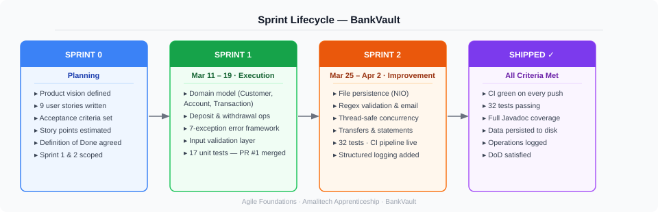
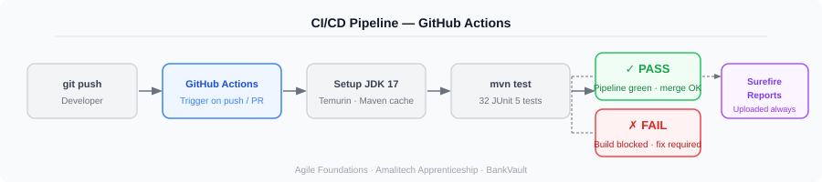

# BankVault — Agile Foundations Submission


**Role:** Apprentice Software Developer  
**Organisation:** Amalitech Apprenticeship Programme  
**Frameworks applied:** Scrum · CI/CD · Test-Driven Development  
**Tech stack:** Java 17 · Maven · JUnit 5 · Mockito · GitHub Actions

---

## What This Is

BankVault is a console-based banking system built to demonstrate practical Agile and DevOps delivery. The application allows bank tellers to register customers, manage accounts, process transactions, and generate statements — with file persistence, thread-safe concurrency, and a live CI pipeline.

The project was delivered across two execution sprints, preceded by a planning sprint (Sprint 0). Each sprint produced working, tested, and integrated software — not documentation artefacts.

> **Foundation note:** This project builds on a base scaffold from the Amalitech apprenticeship programme. All feature development, architecture decisions, testing, persistence, concurrency, CI integration, and monitoring documented here were individually authored as iterative delivery on top of that foundation.

---

## Agile Process



| Sprint | Dates | Goal | Stories | Points |
|---|---|---|---|---|
| Sprint 0 | Pre-Mar 11 | Plan the backlog, define DoD, scope sprints | — | — |
| Sprint 1 | Mar 11–19 | Core banking operations: customers, accounts, transactions | US-01 to US-04 | 11 |
| Sprint 2 | Mar 25–Apr 2 | Persistence, transfers, CI pipeline, logging | US-05 to US-09 | 15 |

---

## Sprint Documents

| Document | Description |
|---|---|
| [Sprint 0 — Planning](docs/agile/sprint-0-planning.md) | Product vision, full backlog with acceptance criteria, Definition of Done, sprint plans |
| [Sprint 1 — Review](docs/agile/sprint-1-review.md) | Delivered stories, key commits, test results, demo summary |
| [Sprint 1 — Retrospective](docs/agile/sprint-1-retro.md) | What went well, what to improve, action items for Sprint 2 |
| [Sprint 2 — Review](docs/agile/sprint-2-review.md) | Delivered stories, key commits, monitoring evidence, demo summary |
| [Sprint 2 — Final Retrospective](docs/agile/sprint-2-retro.md) | Process improvements applied, lessons learned, final reflection |

---

## CI/CD Pipeline

Every push to `main` and every pull request triggers an automated build on GitHub Actions.



The pipeline runs `mvn --batch-mode test`. If any of the 32 tests fail, the build is marked failed and the merge is blocked. Surefire reports are uploaded as build artefacts on every run.

**Pipeline configuration:** [`.github/workflows/maven.yml`](.github/workflows/maven.yml)

---

## Test Coverage

| Test File | Tests | What is covered |
|---|---|---|
| `AccountTest` | 8 | Core account state: balance, status, account type |
| `AccountServiceTest` | 9 | Service operations: create, deposit, withdraw, transfer, fees, interest |
| `TransactionManagerTest` | 3 | Ledger correctness: totals by type, thread-safe recording |
| `ExceptionTest` | 12 | Custom exception hierarchy, input validator edge cases, closed-account guards |
| **Total** | **32** | |

Run locally:
```bash
mvn test
```

---

## Monitoring

Structured operation logging was added in Sprint 2 using `java.util.logging.Logger`. Key events logged at `INFO` level in `BankController`:

- Application start and shutdown
- Account creation (account number, customer name, account type)
- Transaction completed (account, type, amount)
- Transfer completed (source, destination, amount)
- Manual and auto data saves

Transaction-level ledger entries are logged at `FINE` level in `TransactionManager` — available when verbose logging is configured.

---

## How to Run

**Prerequisites:** Java 17+, Maven 3.6+

```bash
git clone https://github.com/nellybutera/agile-foundations.git
cd agile-foundations
mvn compile exec:java -Dexec.mainClass="com.bank_management_system.Main"
```

---

## Project Structure

```
.
├── .github/workflows/maven.yml        ← CI pipeline
├── assets/diagrams/
│   ├── sprint-lifecycle.svg
│   └── cicd-pipeline.svg
├── docs/agile/
│   ├── sprint-0-planning.md
│   ├── sprint-1-review.md
│   ├── sprint-1-retro.md
│   ├── sprint-2-review.md
│   └── sprint-2-retro.md
├── src/
│   ├── main/java/com/bank_management_system/
│   │   ├── accounts/                  ← Account, SavingsAccount, CheckingAccount
│   │   ├── bank/                      ← Bank
│   │   ├── customers/                 ← Customer, RegularCustomer, PremiumCustomer
│   │   ├── exceptions/                ← 7 custom exceptions + InputValidator
│   │   ├── persistence/               ← FilePersistenceService
│   │   ├── services/                  ← StatementGenerator
│   │   ├── transactions/              ← Transaction, TransactionManager
│   │   ├── utils/                     ← FunctionalUtils, ValidationUtils, ConcurrencyUtils
│   │   ├── BankController.java        ← Menu controller + operation logging
│   │   ├── DataInitializer.java
│   │   ├── InputReader.java
│   │   └── Main.java
│   └── test/java/com/bank_management_system/
│       ├── AccountTest.java
│       ├── AccountServiceTest.java
│       ├── ExceptionTest.java
│       ├── TransactionManagerTest.java
│       └── TestResultLogger.java
└── pom.xml
```
